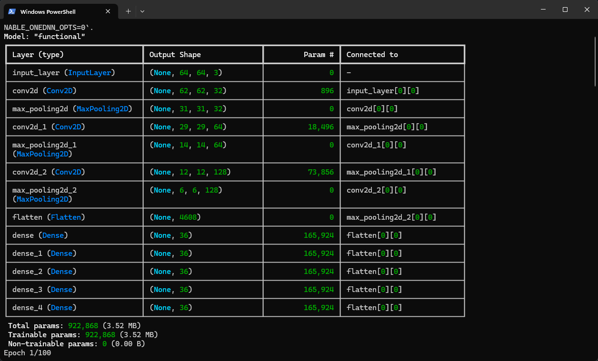
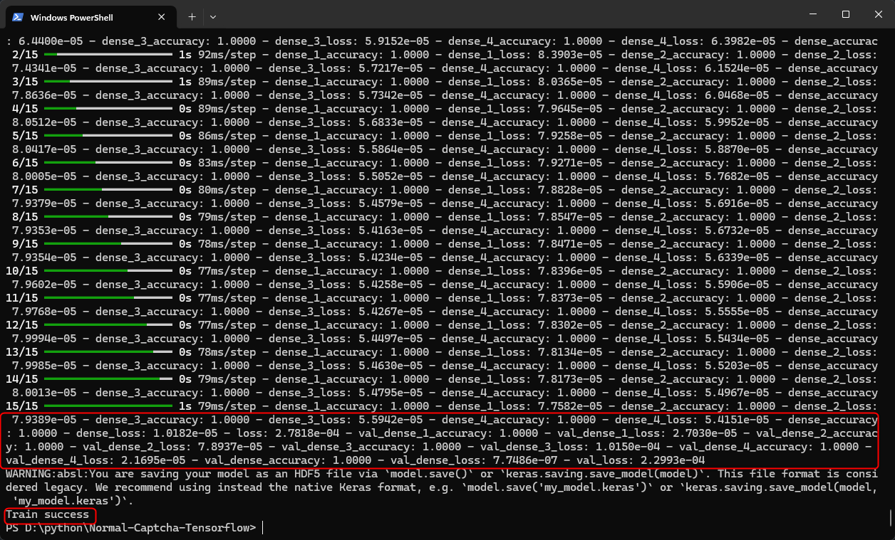
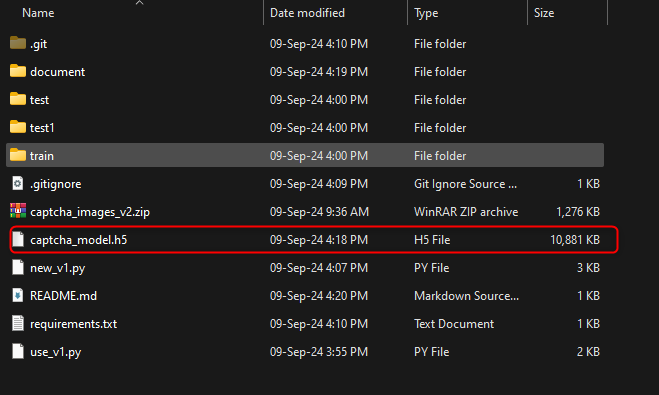
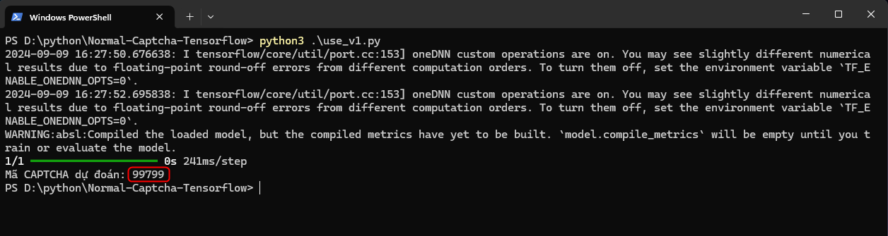

# Normal-Captcha-Tensorflow
AI detect

## Description
Nhận dạng mã captcha từ bộ dữ liệu dựng sẵn

## Installation
```bash
$ pip install <lib>
```
## Running the tool

```bash
# training
$ python3 new_v1.py
```
### Model


### Results


### File Train


## Use train file
Đổi đường dẫn trỏ tới file cần detect và run script


